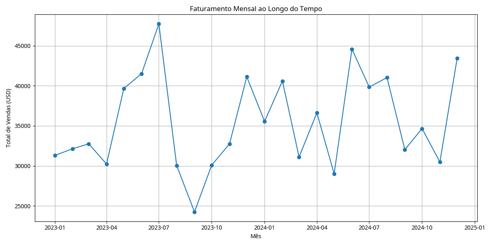
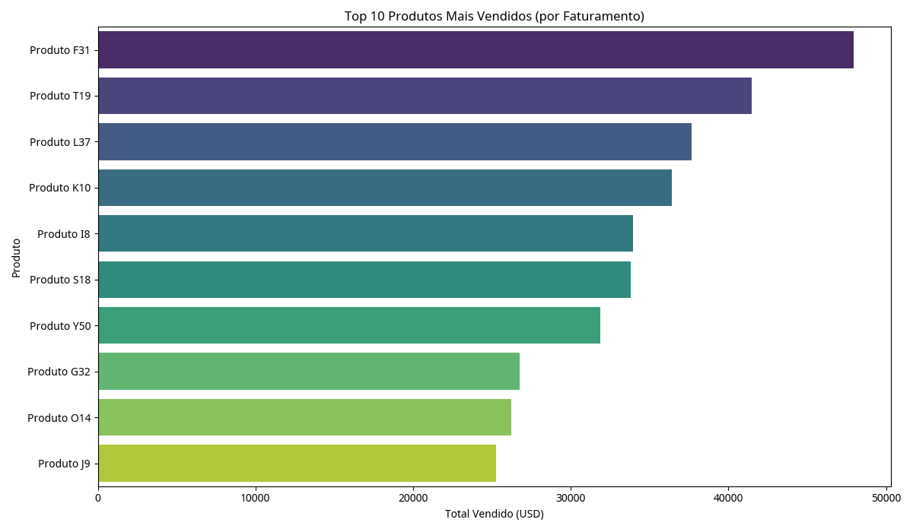
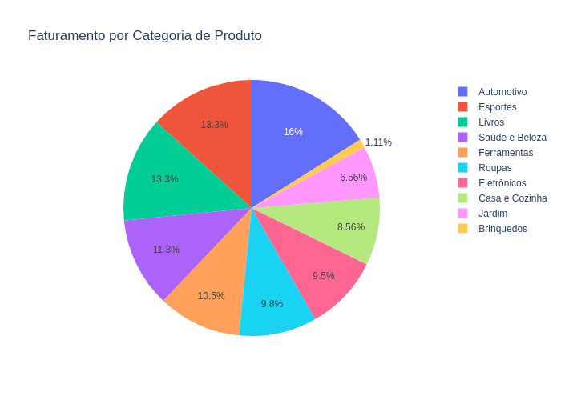
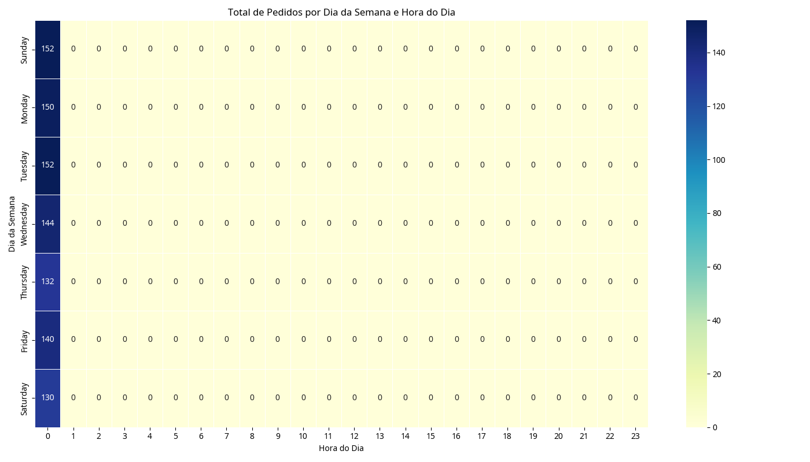

# Análise de Vendas de E-commerce com SQL e Python (Projeto Gratuito e Local)

Este projeto foi cuidadosamente elaborado para ser um guia completo e acessível para iniciantes no mundo da análise de dados. Ele demonstra, passo a passo, como realizar uma análise abrangente de dados de vendas de um e-commerce fictício, utilizando apenas ferramentas gratuitas e operando localmente em sua máquina. Não há necessidade de serviços em nuvem pagos, configurações complexas de API ou informações de cartão de crédito.

## 📊 Descrição Detalhada do Projeto

O objetivo principal deste projeto é simular um cenário real de análise de dados de vendas. Você aprenderá a:

1.  **Gerar Dados Fictícios**: Criaremos um conjunto de dados de vendas de e-commerce do zero, com informações realistas sobre pedidos, produtos e clientes.
2.  **Armazenar Dados Localmente**: Utilizaremos o SQLite, um sistema de gerenciamento de banco de dados leve e embutido, para armazenar e gerenciar nossos dados de forma eficiente.
3.  **Consultar Dados com SQL**: Aprenderemos a escrever e executar consultas SQL para extrair informações valiosas do nosso banco de dados, como total de vendas, produtos mais populares e faturamento por categoria.
4.  **Analisar e Visualizar Dados com Python**: Usaremos bibliotecas populares do Python (pandas, matplotlib, seaborn e plotly) para processar os dados extraídos, realizar limpezas simples e criar visualizações impactantes que revelam insights de negócios.
5.  **Documentar o Processo**: Todo o processo será documentado de forma clara, permitindo que você replique o projeto e entenda cada etapa.

Este projeto é uma excelente base para quem busca construir um portfólio em análise de dados, praticar SQL e Python, e entender o fluxo de trabalho de um projeto de dados do início ao fim.

## 🛠️ Tecnologias Utilizadas (e Por Que as Escolhemos)

Todas as tecnologias foram selecionadas por serem gratuitas, de código aberto e amplamente utilizadas na indústria, tornando este projeto acessível e relevante para o aprendizado:

-   **Python 3.11+**: A linguagem de programação principal. É versátil, fácil de aprender e possui um ecossistema robusto para análise de dados.
-   **SQLite**: Um sistema de gerenciamento de banco de dados relacional que não requer um servidor separado. É perfeito para projetos locais e pequenos, pois o banco de dados é armazenado em um único arquivo (`.db`).
-   **pandas**: Uma biblioteca Python fundamental para manipulação e análise de dados. Ela nos permite carregar, limpar, transformar e agregar dados de forma eficiente.
-   **matplotlib**: Uma biblioteca de plotagem 2D para Python. Usada para criar gráficos estáticos de alta qualidade.
-   **seaborn**: Construída sobre o matplotlib, oferece uma interface de alto nível para desenhar gráficos estatísticos atraentes e informativos.
-   **plotly**: Uma biblioteca para criar gráficos interativos e visualizações web. Ideal para dashboards e relatórios dinâmicos.
-   **Faker**: Uma biblioteca Python para gerar dados fictícios realistas (nomes, datas, cidades, etc.), essencial para criar nosso dataset de e-commerce do zero.
-   **kaleido**: Uma dependência do Plotly que permite exportar gráficos interativos para formatos de imagem estáticos (como PNG).

## 📁 Estrutura do Projeto

O projeto está organizado da seguinte forma para facilitar a navegação e compreensão:

```
bigquery_ecommerce_analysis/
├── generate_data.py          # Script Python para gerar o dataset fictício de vendas.
├── load_data_to_sqlite.py    # Script Python para carregar o CSV gerado para o banco de dados SQLite.
├── sqlite_queries.py         # Módulo Python contendo todas as consultas SQL utilizadas no projeto.
├── main.py                   # Script Python principal que orquestra a análise, limpeza e visualização dos dados.
├── ecommerce_data.csv        # O arquivo CSV gerado com os dados fictícios de e-commerce.
├── ecommerce.db              # O arquivo do banco de dados SQLite, contendo a tabela de vendas.
├── plots/                    # Diretório onde todos os gráficos gerados serão salvos como imagens.
│   ├── faturamento_mensal.png
│   ├── top_produtos_vendidos.png
│   ├── faturamento_por_categoria.png
│   └── heatmap_vendas_dia_hora.png
├── insights.md               # Um arquivo Markdown com um resumo dos principais insights encontrados na análise.
└── README.md                 # Este arquivo, contendo todas as instruções e informações do projeto.
```

## 🚀 Como Executar o Projeto (Passo a Passo Detalhado)

Siga estas instruções cuidadosamente para configurar e executar o projeto em sua máquina local.

### Pré-requisitos

Certifique-se de ter o Python instalado em seu sistema. Recomendamos a versão 3.11 ou superior. Você pode baixá-lo em [python.org](https://www.python.org/downloads/).

### Passo 1: Clonar o Repositório (ou Baixar os Arquivos)

Se você estiver usando Git, clone este repositório para sua máquina local:

```bash
git clone https://github.com/seu-usuario/ecommerce-sales-analysis-python-sql.git
cd ecommerce-sales-analysis-python-sql
```

Se não estiver usando Git, baixe o arquivo ZIP do repositório e extraia-o para uma pasta de sua escolha. Em seguida, navegue até essa pasta no seu terminal ou prompt de comando.

### Passo 2: Instalar as Dependências do Python

Abra seu terminal (ou prompt de comando no Windows) na pasta raiz do projeto (`ecommerce-sales-analysis-python-sql`). Execute o seguinte comando para instalar todas as bibliotecas Python necessárias. É altamente recomendável usar um ambiente virtual para isolar as dependências do projeto.

```bash
pip install pandas matplotlib seaborn plotly faker kaleido
```

-   `pandas`: Para manipulação de DataFrames.
-   `matplotlib`, `seaborn`, `plotly`: Para a criação de gráficos.
-   `faker`: Para a geração de dados fictícios.
-   `kaleido`: Para salvar os gráficos do Plotly como imagens.

### Passo 3: Gerar o Dataset Fictício de Vendas

Nesta etapa, criaremos o arquivo `ecommerce_data.csv` que servirá como nossa fonte de dados. Este script utiliza a biblioteca `Faker` para gerar dados realistas.

No terminal, na pasta raiz do projeto, execute:

```bash
python generate_data.py
```

Você verá mensagens no terminal indicando o progresso da geração dos dados. Ao final, o arquivo `ecommerce_data.csv` será criado na pasta raiz do projeto.

### Passo 4: Carregar os Dados para o Banco de Dados SQLite

Agora que temos nosso arquivo CSV, vamos carregá-lo para um banco de dados SQLite. Isso simula um ambiente de banco de dados real e nos permite praticar consultas SQL.

No terminal, na pasta raiz do projeto, execute:

```bash
python load_data_to_sqlite.py
```

Este comando criará (ou recriará, se já existir) o arquivo `ecommerce.db` na pasta raiz do projeto e inserirá todos os dados do `ecommerce_data.csv` em uma tabela chamada `vendas` dentro deste banco de dados.

### Passo 5: Executar a Análise de Dados e Gerar as Visualizações

Esta é a etapa principal onde a mágica acontece! O script `main.py` se conectará ao banco de dados SQLite, executará as consultas SQL definidas em `sqlite_queries.py`, processará os dados com `pandas` e gerará todos os gráficos solicitados.

No terminal, na pasta raiz do projeto, execute:

```bash
python main.py
```

Você verá mensagens no terminal sobre a execução das consultas e a geração dos gráficos. Ao final, uma nova pasta chamada `plots/` será criada (se ainda não existir), contendo todas as imagens dos gráficos gerados.

## 📈 Análises Realizadas e Consultas SQL Correspondentes

O script `main.py` executa as seguintes análises, utilizando as consultas SQL definidas em `sqlite_queries.py`:

1.  **Faturamento Mensal**: Calcula o total de vendas por mês para identificar tendências e sazonalidades.
    -   **Consulta SQL**: `TOTAL_VENDAS_POR_MES`
2.  **Top 10 Produtos Mais Vendidos**: Identifica os produtos que geraram o maior faturamento.
    -   **Consulta SQL**: `PRODUTOS_MAIS_VENDIDOS`
3.  **Faturamento por Categoria de Produto**: Mostra a distribuição do faturamento entre as diferentes categorias de produtos.
    -   **Consulta SQL**: `FATURAMENTO_POR_CATEGORIA`
4.  **Média de Valor Gasto por Cliente**: Calcula o valor médio que cada cliente gasta.
    -   **Consulta SQL**: `MEDIA_VALOR_GASTO_POR_CLIENTE`
5.  **Tendência de Vendas ao Longo do Tempo (Diário)**: Analisa o volume de vendas dia a dia.
    -   **Consulta SQL**: `TENDENCIA_VENDAS_TEMPO`
6.  **Heatmap de Vendas por Dia da Semana e Hora do Dia**: Visualiza os horários de pico de vendas, agrupados por dia da semana e hora do dia.
    -   **Consulta SQL**: `VENDAS_POR_DIA_SEMANA`

## 📊 Visualizações Geradas

Após executar o `main.py`, os seguintes gráficos serão salvos na pasta `plots/`:

### Faturamento Mensal ao Longo do Tempo
Este gráfico de linha mostra a evolução do faturamento total do e-commerce mês a mês, permitindo identificar padrões de crescimento, declínio ou sazonalidade.



### Top 10 Produtos Mais Vendidos (por Faturamento)
Um gráfico de barras que destaca os dez produtos que mais contribuíram para o faturamento total, indicando quais itens são os carros-chefes do e-commerce.



### Faturamento por Categoria de Produto
Um gráfico de pizza que ilustra a proporção do faturamento total de cada categoria de produto, revelando quais segmentos são mais lucrativos.



### Heatmap de Pedidos por Dia da Semana e Hora do Dia
Este heatmap visualiza a densidade de pedidos em diferentes dias da semana e horas do dia, ajudando a identificar os períodos de maior e menor atividade de vendas.



## 🔍 Principais Insights da Análise

Para uma análise mais aprofundada e um resumo dos insights extraídos, consulte o arquivo [insights.md](insights.md). Alguns dos pontos chave incluem:

-   **Sazonalidade de Vendas**: Identificação de meses ou períodos específicos com maior ou menor volume de vendas.
-   **Produtos de Alta Performance**: Conhecimento dos produtos que mais geram receita, permitindo otimizar estoque e estratégias de marketing.
-   **Categorias Chave**: Entendimento das categorias de produtos que dominam o faturamento, direcionando investimentos e foco.
-   **Picos de Atividade**: Identificação dos dias da semana e horários com maior volume de pedidos, útil para planejamento operacional e campanhas direcionadas.

## 📚 Aprendizados com Este Projeto

Ao completar este projeto, você terá uma compreensão prática e sólida dos seguintes conceitos e habilidades:

-   **Geração de Dados Fictícios**: Como criar datasets sintéticos para testes e prototipagem.
-   **Gerenciamento de Banco de Dados Local**: Uso do SQLite para armazenar e interagir com dados de forma simples e eficiente.
-   **Consultas SQL Essenciais**: Como extrair e agregar dados usando SQL para responder a perguntas de negócios.
-   **Processamento de Dados com Pandas**: Técnicas de carregamento, limpeza e transformação de dados em Python.
-   **Visualização de Dados**: Criação de diversos tipos de gráficos para comunicar insights de forma eficaz.
-   **Estrutura de Projeto de Dados**: Organização de arquivos e scripts para projetos de análise de dados.
-   **Documentação de Código e Projetos**: A importância de um `README` claro e detalhado para replicabilidade e colaboração.

## 🤝 Contribuições

Contribuições são sempre bem-vindas! Se você tiver sugestões de melhoria, novas análises ou correções, sinta-se à vontade para:

1.  Fazer um fork (ramificação) deste repositório.
2.  Criar uma nova branch para sua funcionalidade (`git checkout -b feature/MinhaNovaFuncionalidade`).
3.  Realizar suas alterações e fazer commit (`git commit -m 'Adiciona Minha Nova Funcionalidade'`).
4.  Enviar suas alterações para o seu fork (`git push origin feature/MinhaNovaFuncionalidade`).
5.  Abrir um Pull Request para este repositório.

## 📄 Licença

Este projeto é de código aberto e está disponível sob a licença MIT. Sinta-se à vontade para usá-lo, modificá-lo e distribuí-lo.

## 👨‍💻 Autor

Este projeto foi criado como um exemplo educacional para demonstrar um fluxo de trabalho completo de análise de dados utilizando ferramentas gratuitas e acessíveis.

---

**Importante**: Todos os dados utilizados neste projeto são fictícios e gerados automaticamente. Eles não representam dados reais de clientes ou transações de vendas.

